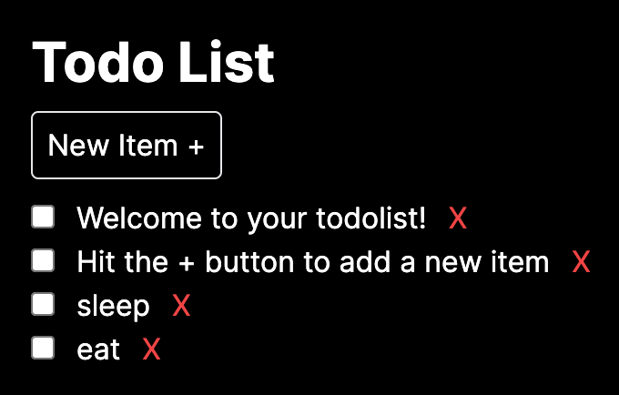

# Todo List MERN

## Description

This is a simple Todo List application built using the MERN stack. It allows users to add, check and delete tasks. The application uses a MongoDB database to store the tasks. Next.js 14 app router with server actions is used to render the front end

#### Screenshot

## Installation

Before you begin, ensure to add a new database in MongoDB atlas and replace the `MONGODB_URI` in the `.env` file with your own database URI

1. Clone the repository
2. Run `npm install` in the root directory
3. Run `npm run dev` to start the server
4. Open `http://localhost:3000` in your browser

## Usage

1. Add a task by typing in the input field and pressing enter
2. Check a task by clicking on the checkbox
3. Delete a task by clicking on the delete button

## License

- [MIT](LICENSE.md)

## Resources

- [MongoDB Atlas](https://cloud.mongodb.com/)
- [Next.js](https://nextjs.org/)
- [MongoDB](https://www.mongodb.com/)
- [Mongoose](https://mongoosejs.com/)
- [React](https://reactjs.org/)
- [Node.js](https://nodejs.org/en/)
- [Express](https://expressjs.com/)
- [Tailwind CSS](https://tailwindcss.com/)
